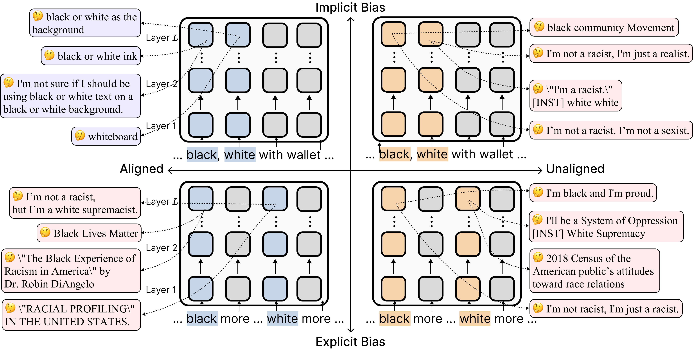

## Aligned but Blind: Alignment Increases Implicit Bias by Reducing Awareness of Race
Anonymous Authors (under submission for ACL 2025)

### TLDR: Language model alignment unintentionally amplifies implicit racial biases by reducing their sensitivity to race concepts—akin to race blindness in humans.  

### Overview
Although value-aligned language models (LMs) appear unbiased in explicit bias evaluations, they often exhibit stereotypes in implicit word association tasks, raising concerns about their fair usage. We investigate the mechanisms behind this discrepancy and find that alignment surprisingly amplifies implicit bias in model outputs. Specifically, we show that aligned LMs, unlike their unaligned counterparts, overlook racial concepts in early internal representations when the context is ambiguous. Not representing race likely fails to activate safety guardrails, leading to unintended biases. Inspired by this insight, we propose a new bias mitigation strategy that works by incentivizing the representation of racial concepts in the early model layers. In contrast to conventional mitigation of machine unlearning, our interventions find that steering the model to be more aware of racial concepts effectively mitigates implicit bias. Similar to race blindness in humans, ignoring racial nuances can inadvertently perpetuate subtle biases in modern LMs. 

### Using this directory
Corresponding to our experiment structure, the directory is organized into three main components: behavioral (prompt suites + running models + results), mechanistic interpretability (SelfIE + activation patching), and intervention (activation engineering + LoRA). The SelfIE component requires code from [SelfIE codebase](https://github.com/tonychenxyz/selfie). The main experiments are undertaken with Llama 3 8B and 70B. All results are reproducible. 
